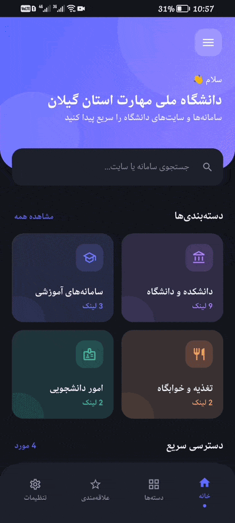
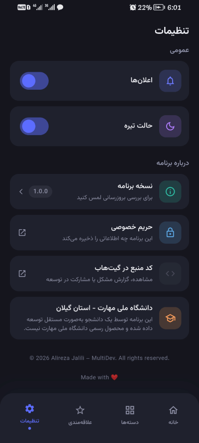

<div align="center">


# 🎓 SARAD | Gilan National University of Skills Links
### سراد | لینک‌های دانشگاه ملی مهارت - گیلان

</div>

> 🇮🇷 [Persian/فارسی](#فارسی) | 🇬🇧 [English](#english)

---

<div align="center">

<table>
  <tr>
    <td align="center"><br/><sub>جستجو</sub></td>
    <td align="center"><br/><sub>تنظیمات</sub></td>
  </tr>
</table>

</div>

---

## English

### About
**SARAD** — a simple Flutter app I built for quick access to the portals and websites of **National University of Skills (TVU) - Gilan Province**, Iran.

The idea came from constantly having to search for portal URLs like Bustan or Saba every time I needed them. So I decided to put them all in one place.

### Features
- Quick access to university portals (Bustan, Samyad, Saba, Samad, Sajad, etc.)
- Categorized links (Academic, Food & Dorm, Student Affairs, Faculties)
- Search across all links
- Save favorite links (star button)
- Weekly food reservation reminder — once you tap the Saba/Samad link, it reminds you every day from the following Saturday until you reserve again
- Dark Mode support
- Settings and favorites persisted locally
- All institution logos are bundled inside the app — no internet needed to display them, and nothing loads inconsistently on slow/filtered connections
- In-app update check against the latest GitHub release
- A dedicated [Privacy Policy](./PRIVACY.md) page, linked from Settings
- Custom app icon and a light/dark-aware native splash screen

### Tech Stack
- **Flutter** (Dart)
- `url_launcher` — opening links
- `google_fonts` — Vazirmatn font
- `shared_preferences` — local storage
- `flutter_local_notifications` + `timezone` — scheduled notifications
- `shamsi_date` — Persian calendar for holiday detection
- `http` — checking the latest GitHub release for in-app update notices
- `flutter_launcher_icons` / `flutter_native_splash` — dev-only, used to generate the app icon and splash screen assets

### Project Structure
```
lib/
├── main.dart
├── app.dart
├── core/          # colors, app info & shared utilities
├── models/        # data models
├── data/          # links & categories
├── services/      # favorites, settings, notifications, update checker
└── ui/
    ├── pages/     # app screens
    ├── widgets/   # reusable widgets
    └── utils/     # UI-only helpers (e.g. focus/unfocus handling)

assets/
├── images/        # bundled institution/system logos shown in the app
├── icon/          # app icon source images (launcher icon)
└── splash/        # native splash screen source images (light/dark)

screenshots/        # README preview media (not bundled into the app)
```

### Getting Started
```bash
flutter pub get
flutter run
```

> To enable notifications, apply the `AndroidManifest.xml` settings described in `NOTIFICATION_SETUP.md`.

### Checking for Updates
The app isn't (yet) published on any app store, so it ships its own lightweight update checker: **Settings → Version** fetches the latest release from this repository's GitHub Releases and lets you download the new APK directly if one is available.

### Note
Built for TVU Gilan students, but the structure makes it easy to adapt for any university — just edit `lib/data/categories_data.dart` and drop the matching logos into `assets/images/`.

---

<div dir="rtl">

## فارسی

### درباره پروژه
**سراد** (مخفف سامانه راهنمای الکترونیکی دانشگاه) — یه اپلیکیشن ساده که برای دسترسی سریع‌تر به سامانه‌ها و سایت‌های دانشگاه ملی مهارت استان گیلان نوشتم.

انگیزه اصلیم این بود که هر بار باید آدرس سامانه‌هایی مثل بوستان یا صبا رو جستجو می‌کردم یا از تاریخچه مرورگر پیداشون می‌کردم — تصمیم گرفتم همه‌شون رو یه‌جا جمع کنم.

### امکانات
- دسترسی سریع به سامانه‌های دانشگاه (بوستان، سمیاد، صبا، سماد، سجاد و...)
- دسته‌بندی لینک‌ها (آموزشی، تغذیه، امور دانشجویی، دانشکده‌ها)
- جستجو بین همه لینک‌ها
- ذخیره لینک‌های موردعلاقه (با ستاره)
- یادآوری هفتگی رزرو غذا — بعد از اینکه روی لینک صبا/سماد بزنی، از شنبه هفته بعد هر روز یادآوری می‌ده تا وقتی دوباره رزرو کنی
- پشتیبانی از حالت تیره (Dark Mode)
- ذخیره تنظیمات و علاقه‌مندی‌ها بین اجراها
- تمام لوگوهای دانشکده‌ها و سامانه‌ها داخل خود برنامه بسته‌بندی (bundle) شدن — برای نمایششون نیازی به اینترنت نیست و روی اینترنت‌های کند یا محدود هم بدون مشکل نمایش داده می‌شن
- بررسی بروزرسانی از داخل برنامه، بر اساس آخرین نسخه‌ی منتشرشده در گیت‌هاب
- صفحه‌ی [حریم خصوصی](./PRIVACY.md) مجزا، قابل‌دسترس از تنظیمات
- آیکون اختصاصی و اسپلش‌اسکرین نیتیو با پشتیبانی از حالت روشن/تیره

### تکنولوژی‌ها
- **Flutter** (Dart)
- `url_launcher` — باز کردن لینک‌ها
- `google_fonts` — فونت وزیرمتن
- `shared_preferences` — ذخیره‌سازی محلی
- `flutter_local_notifications` + `timezone` — اعلان‌های زمان‌بندی‌شده
- `shamsi_date` — تبدیل تاریخ برای تشخیص تعطیلات شمسی
- `http` — بررسی آخرین نسخه‌ی منتشرشده در گیت‌هاب برای اطلاع‌رسانی بروزرسانی
- `flutter_launcher_icons` / `flutter_native_splash` — فقط زمانِ توسعه، برای ساختِ آیکون و اسپلش‌اسکرین

### ساختار پروژه
```
lib/
├── main.dart
├── app.dart
├── core/          # رنگ‌ها، اطلاعات برنامه و ابزارهای مشترک
├── models/        # مدل‌های داده
├── data/          # لینک‌ها و دسته‌بندی‌ها
├── services/      # علاقه‌مندی‌ها، تنظیمات، اعلان‌ها، بررسی بروزرسانی
└── ui/
    ├── pages/     # صفحات برنامه
    ├── widgets/   # ویجت‌های قابل‌استفاده مجدد
    └── utils/     # ابزارهای مخصوص UI (مثلاً مدیریت فوکوس)

assets/
├── images/        # لوگوهای بسته‌بندی‌شده‌ی دانشکده‌ها/سامانه‌ها
├── icon/          # تصاویر منبعِ آیکون برنامه
└── splash/        # تصاویر منبعِ اسپلش‌اسکرین (حالت روشن/تیره)

screenshots/        # رسانه‌های نمایشی README (داخل خود اپ بسته‌بندی نمی‌شن)
```

### اجرای پروژه
```bash
flutter pub get
flutter run
```

> برای فعال شدن اعلان‌ها، تنظیمات `AndroidManifest.xml` رو هم باید اعمال کنی. راهنماش توی فایل `NOTIFICATION_SETUP.md` هست.

### بررسی بروزرسانی
این برنامه فعلاً روی هیچ استوری منتشر نشده، برای همین خودش یه بررسی‌کننده‌ی بروزرسانیِ ساده داره: از مسیرِ **تنظیمات ← نسخه برنامه**، آخرین Release این ریپازیتوری از گیت‌هاب چک می‌شه و در صورت وجود نسخه‌ی جدید، امکان دانلود مستقیم APK فراهم می‌شه.

### سامانه‌های پوشش داده شده

| سامانه | آدرس |
|--------|-------|
| بوستان (آموزش) | bustan.tvu.ac.ir |
| سمیاد (کلاس مجازی) | samyad.tvu.ac.ir |
| صبا (رزرو غذا) | saba.tvu.ac.ir |
| سماد | samad.app |
| سجاد (امور دانشجویی) | portal.saorg.ir |
| صندوق رفاه دانشجویی | refah.swf.ir |
| دانشگاه ملی مهارت | tvu.ac.ir |
| واحد استان گیلان | guilan.tvu.ac.ir |
| دانشکده شهید چمران رشت | p-rasht.tvu.ac.ir |
| و چند دانشکده/آموزشکده دیگه... | |

### نکته
این پروژه مخصوص دانشجوهای دانشگاه ملی مهارت استان گیلانه ولی ساختارش طوریه که راحت می‌شه برای هر دانشگاه دیگه‌ای هم تنظیمش کرد — کافیه فایل `lib/data/categories_data.dart` رو ویرایش کنی و لوگوهای متناظر رو توی `assets/images/` بذاری.

</div>
